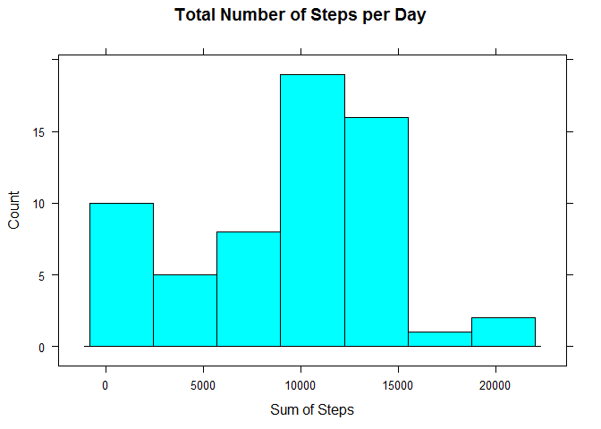
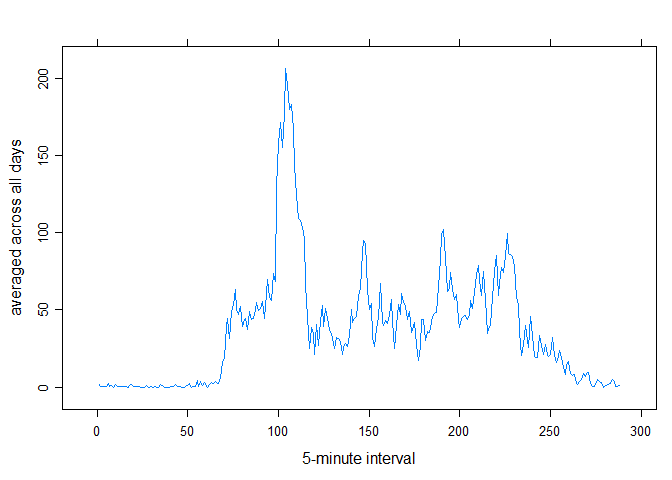
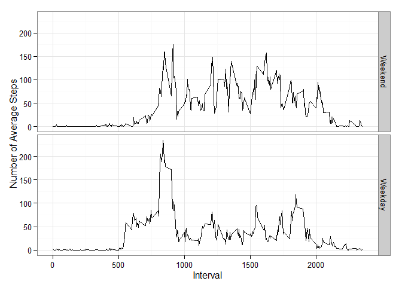

# Reproducible Research: Peer Assessment 1

```r
echo = TRUE
suppressMessages(library(dplyr))
library(lattice)
library(ggplot2)
```

## Loading and preprocessing the data

```r
data <- read.csv("./data/activity.csv", sep = ",")
data$date <- as.Date(data$date)
data$weekday <- as.POSIXlt(data$date)$wday
dataGrouped <- group_by(data, date)
dataGroupedInt <- group_by(data, interval)
```

## What is mean total number of steps taken per day?

```r
stepsPerDay <- summarise(dataGrouped, stepsSum = sum(steps, na.rm = TRUE))
summarise(stepsPerDay, mean(stepsSum), median(stepsSum))
```

```
## Source: local data frame [1 x 2]
## 
##   mean(stepsSum) median(stepsSum)
##            (dbl)            (int)
## 1        9354.23            10395
```

```r
histogram( ~ stepsSum,data=stepsPerDay, type="count", xlab="Sum of Steps", ylab="Count", main="Total Number of Steps per Day")
```

 

## What is the average daily activity pattern?
Timeseries for the steps per Interval

```r
stepsPerInterval <- summarise(dataGroupedInt, stepsSum = mean(steps, na.rm = TRUE))
xyplot(ts(stepsPerInterval$stepsSum), xlab="5-minute interval", ylab="averaged across all days")
```

 

Most steps per Intverval

```r
head(arrange(stepsPerInterval, desc(stepsSum)), 1)
```

```
## Source: local data frame [1 x 2]
## 
##   interval stepsSum
##      (int)    (dbl)
## 1      835 206.1698
```

## Imputing missing values

```r
sum(is.na(data$steps))
```

```
## [1] 2304
```

## Are there differences in activity patterns between weekdays and weekends?

```r
data$weekday <- (data$weekday > 0 & data$weekday < 6)
data$weekday = factor(data$weekday, labels = c("Weekend", "Weekday"))
dataGroupedWeekday <- group_by(data, interval, weekday)

stepsPerWeekday <- summarise(dataGroupedWeekday, steps = mean(steps, na.rm = TRUE))

ggplot(stepsPerWeekday, aes(interval, steps)) +
  geom_line() +
  facet_grid(weekday ~ .) +
  theme_bw() +
  labs(x = "Interval",
       y = "Number of Average Steps")
```

 
